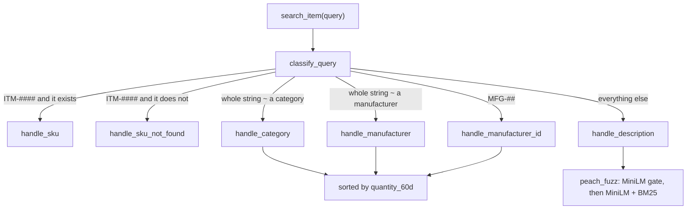

# Remarcable Take Home Challenge

A bit about the challenge: Company A wants to know when to buy and what price to expect. Everyone else just wants to find the right item. This repo is my pass at both. Item search is done. The price model is next.

The search is built for someone standing at a counter, typing fast, sometimes with a SKU, sometimes with a category, sometimes with a half-remembered description. Waiting on a model for a SKU lookup would be a bad joke, so the pipeline only spends that time when the query is actually free text.

## Repo structure

I'm basically building over the repo you shared. The assignment already ships the lakehouse, the bronze extracts, and `data/search_queries.csv`. Below is the rest of the repo, plus the pieces I added or changed under `dbt_project/` and `data/`.

```
.
├── assignment.md
├── Makefile
├── requirements.txt
├── requirements-dbt.txt
├── Dockerfile
├── docker-compose.yml
├── scripts/
│   └── export_layers.py
├── notebooks/
│   ├── item_search.ipynb          # data exploration and testings
│   └── peach_fuzz_tuning.ipynb    # here I optimized the search engine pipeline
├── src/
│   ├── item_search/
│   │   ├── search_pipeline.py     # <---------- THIS IS THE ITEM SEARCH FUNCTION
│   │   ├── router.py              # smart query routing
│   │   ├── handlers.py            # router handlers
│   │   ├── index.py               # encoders and BM25 indexes builder
│   │   ├── peach_fuzz.py          # MiniLM + BM25 for free text
│   │   ├── evals.py
│   │   ├── config.py              # the settings the optimization settled on
│   │   └── utils.py
│   └── price_model/
├── dbt_project/
│   └── models/gold/
│       ├── dim_item.sql            # Added search_text: description + category + manufacturer
│       ├── item_popularity.sql     # 60-day order volume, used to rank browse results
│       └── _gold.yml               # not_null test on search_text
└── data/
    ├── search_queries.csv          # the 40 queries that came with the assignment
    ├── query_tests.csv             # my own queries
    ├── bronze/
    │   └── ...
    ├── silver/
    │   └── ...
    └── gold/
        └── ...                     # includes item_popularity.csv
```

## Quick start

Python 3.10+ and Docker (I kept your `requirements.txt` and just added a few more libraries). The dbt container uses `requirements-dbt.txt`.

```sh
make setup      # dbt image + a venv with the analysis dependencies
make data       # dbt build into data/warehouse.duckdb, then export silver/ and gold/ CSVs
```

`make dbt`, `make test`, and `make export` are the individual steps. Without Docker, `make data-local` does the same from the venv. `make all` currently runs `make data`.

`search_item` reads `data/warehouse.duckdb`, so run `make data` before trying a query. **The first import also loads** `all-MiniLM-L6-v2`**. If that model is not cached yet, the download needs a network.**

## Item search

### Task objective

A function that takes a free-text query and returns ranked catalog items (`item_id`, a relevance score, and enough context to see why). People type `12 awg thhn blk`, `emt 1/2 conduit`, `gfci 20a`, and they misspell and abbreviate freely. The shipped file `data/search_queries.csv` is the official test. `data/query_tests.csv` is mine.

For me, in this case two things matter more than a heavy robust model. Latency, because a user is waiting, and especially if they search a list of items. And recall over precision: a hidden item they would have bought or tracked is a miss, an extra row is noise they can scroll past. Precision still has a budget.

### Implementation, short version

`search_item(query)` classifies the query, then hands it to one handler.

| Intent            | What the user typed                 | What comes back                            |
| ----------------- | ----------------------------------- | ------------------------------------------ |
| `sku`             | a real `ITM-####`                   | that one item                              |
| `sku_not_found`   | well-formed SKU, not in the catalog | a few near SKUs, by edit distance          |
| `category`        | a category name, typos included     | every item in that category                |
| `manufacturer`    | a manufacturer name                 | every item they make                       |
| `manufacturer_id` | `MFG-##`                            | every item with that id                    |
| `description`     | anything else                       | up to 3 items whose `search_text` is close |

SKU is an exact hit. Description results are sorted by the fused score from `peach_fuzz`. Category, manufacturer, and manufacturer id return a pile of items, so those lists are sorted by 60-day order volume from `gold.item_popularity`.

### Pipeline



### Try `search_item`

From the repo root, with the venv active and the warehouse built:

```python
from src.item_search.search_pipeline import search_item

search_item("ITM-0101")
search_item("Wire & cable")
search_item("Northwire co.")
search_item("MFG-01")
search_item("12 awg thhn blk")
```

The index and the description embeddings are built once, at import. The first call pays for that. Later calls are the lookup.

Every handler returns the same shape: `query`, `intent`, `matched_value`, `item_id`, `item_score`, `route_score`. `item_score` is the fused similarity on description hits and the edit-distance similarity on a missing SKU. Browse results leave it empty, because popularity already decided the order. `route_score` is how sure the router was (100 on a regex hit, the fuzzy score on a category or manufacturer).

### Run the evals

```python
from src.item_search.evals import evaluate_search

evaluate_search()
```

That scores `data/search_queries.csv` and `data/query_tests.csv`. Each query has equal weight.

- **Recall**: share of expected items that came back.
- **Precision**: share of returned items that were expected.
- **F1**: mean of the per-query F1.
- **MRR** and **MAP**: ranking quality. Queries with an empty expected set are skipped, since there is no relevant item to rank.
- **latency_ms** and **latency_p95_ms**: time inside `search_item`, after a warmup query.

A no-match query (empty expected set) scores perfectly when the list is empty. Returning anything drops precision.

### Why it is built this way

One model for every query would be simpler, but slower, and worse at the lookups people actually do. A SKU is a key. A category is a small closed list. A manufacturer is another small closed list. Free text is the only case that needs embeddings. Also, having each case separated allows me to implement different behaviours, like ranking by popularity when someone looks up a broad category of items.

`build_index` reads `gold.dim_item` and `gold.item_popularity` once:

- `sku_lookup` for an O(1) id hit
- sorted category and manufacturer vocabularies for fuzzy matching
- item ids grouped by category, manufacturer name, and manufacturer id, already sorted by `quantity_60d`

`classify_query` is a cascade router, cheapest and most certain first:

1. Regex `ITM-####`. Hit the lookup, or call it `sku_not_found`.
2. Regex `MFG-##`.
3. Whole-string `rapidfuzz` ratio against the category list (threshold 87.5).
4. Same against the manufacturer list.
5. Whatever is left is a description.

Whole-string ratio, on purpose. A description that merely contains the word "wire" should stay a description. Partial ratio would steal it.

`peach_fuzz` searches `gold.dim_item.search_text`, which is description, category, and manufacturer name glued together in dbt. Two channels:

- **Semantic**: `all-MiniLM-L6-v2`, cosine via a dot product of unit vectors.
- **Lexical**: BM25 on `[a-z0-9]+` tokens, so `1/2` and `12` survive as tokens.

The semantic score is a gate (`semantic_floor`). Only items the embedding already finds plausible get a fused score, `alpha * semantic + (1 - alpha) * bm25`, with BM25 rescaled inside that candidate set. That stops a rare token from looking like a confident match when the meaning is nowhere close. Abbreviations, units, and light synonyms are left to the embedding and to BM25.

Browse ranking uses the last 60 days of ordered quantity, ending at the latest order date in the warehouse. The objective is to show the user the items they are more likely looking for.

### Optimization

PeachFuzz (the logic for open search) has four params: `alpha`, `semantic_floor`, `top_k`, and the fused-score cutoff in `handle_description`. Raising the floor rebuilds the BM25 scale, so a floor that looks worse at one cutoff can be the better one at another. `[notebooks/peach_fuzz_tuning.ipynb](notebooks/peach_fuzz_tuning.ipynb)` generates a grid to find the best performance of PeachFuzz on the queries provided in `query_test.csv`.

The rule: keep recall at or above 0.90, then take the highest precision. Three encoders were tested: `all-MiniLM-L6-v2`, `mxbai-embed-xsmall-v1` and `bge-small-en-v1.5`. MiniLM won.

The settings now in `config.py`:

| knob           | value              |
| -------------- | ------------------ |
| model          | `all-MiniLM-L6-v2` |
| alpha          | 0.8                |
| semantic floor | 0.45               |
| top k          | 3                  |
| fused cutoff   | 0.60               |

You can find a more elaborated documentation on Evals and final results in `[outputs/item_search_evals.pdf](outputs/item_search_evals.pdf)`.

### My own queries

`data/search_queries.csv` is almost entirely description language: exact, misspelled, abbreviated, partial, word order, and a few queries that should match nothing. It never asks "show me the category" or "show me this manufacturer."

`data/query_tests.csv` is that missing half. Fifty-three queries:

- **Category** (10 names × exact, typo, abbreviation). Exact and light typos should route to `category` and return the whole group, popular items first. Short forms like `gnd`, `ltg`, and `w&c` ask whether whole-string fuzzy is enough, or whether they fall through to `peach_fuzz` and only recover a few items.
- **Manufacturer** (4 names, same three flavors). Same question, including clipped names like `n.wire` and `luminex fix.`
- **SKU**. A real id, a well-formed id that does not exist (`ITM-9999`, expected empty), and two typos that are not valid SKUs (`ITM-01011`, `ITM-O440`). Those last two miss the regex, so they have to be rescued as descriptions.
- **Manufacturer id**. `MFG-01` should list that manufacturer's items. `MFG-99` should come back empty.
- **Description partials**. `thhn 14 awg`, `wire nut`, and friends, where several items are right and top 3 might not hold all of them.

## Price model

Coming up.

## My Decisions

*Document how you decided, and what you rejected. We will ask about them in the follow-up interview.*

|  | Decision |
| :---- | :---- |
| 1.1 | How you defined "the items we buy most often", and how you framed the prediction target and the train/test split |
| 1.2 | How you decided whether a time-of-year effect is real, and how that shaped the recommendation and its caveats |
| 1.3 | Why the models rank the way they do, and what the explanation says about the drivers of price |
| 2.1 | How you handled abbreviations, units and synonyms in queries and descriptions |
| 2.2 | Why this ranking technique for a catalog of this size |
| 2.3 | How you evaluated, what you tested beyond our query set, and how it would scale |

## Thanks

*Built with ❤️ in 48 hours.*
