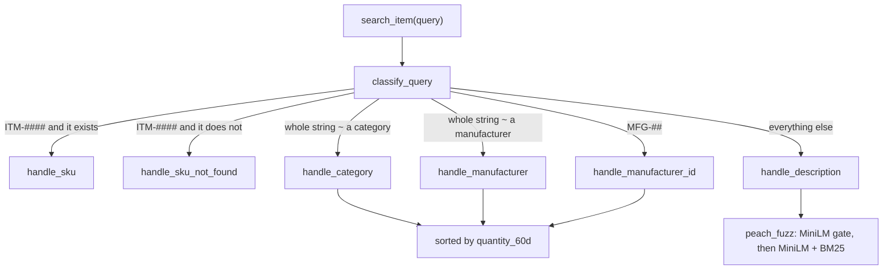
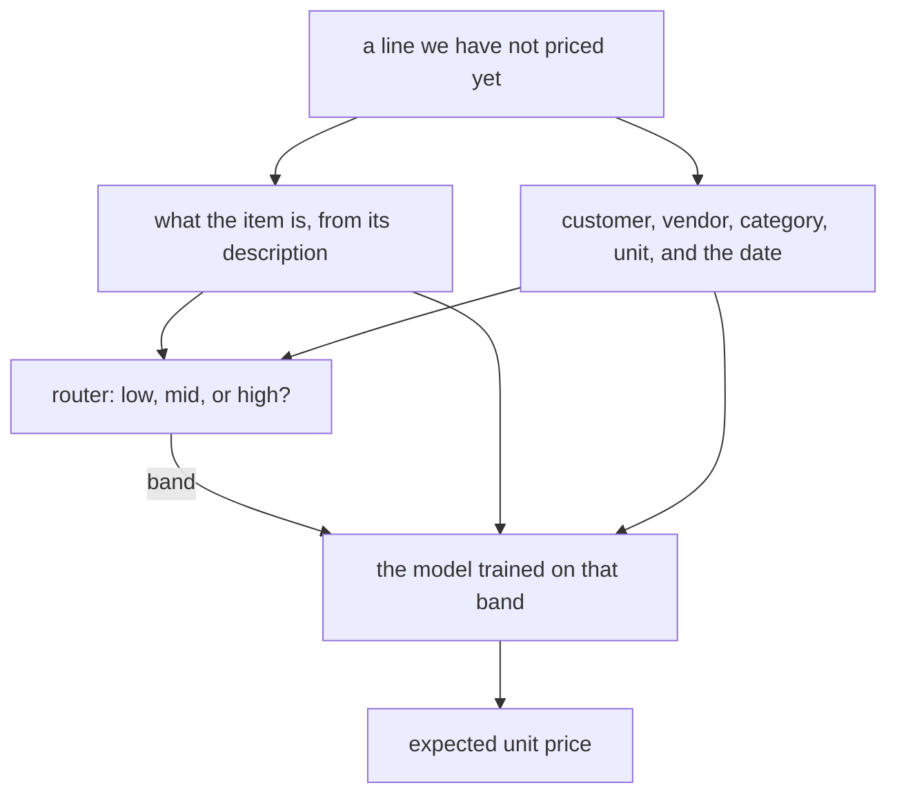

# Remarcable Take Home Challenge

A bit about the challenge: Company A wants to know when to buy and what price to expect. Everyone else just wants to find the right item. This repo is my pass at both. Item search is done. When to buy and what price to expect are written up below.

The search is built for someone standing at a counter, typing fast, sometimes with a SKU, sometimes with a category, sometimes with a half-remembered description. Waiting on a model for a SKU lookup would be a bad joke, so the pipeline only spends that time when the query is actually free text.

## Repo structure

I'm basically building over the repo you shared. The assignment already ships the lakehouse, the bronze extracts, and `data/search_queries.csv`. Below is the rest of the repo, plus the pieces I added or changed.

```
.
├── assignment.md
├── Makefile
├── requirements.txt
├── requirements-dbt.txt
├── Dockerfile
├── docker-compose.yml
├── scripts/
│   └── export_layers.py
├── notebooks/
│   ├── item_search.ipynb          # data exploration and testings
│   ├── peach_fuzz_tuning.ipynb    # here I optimized the search engine pipeline
│   ├── pm_eda.ipynb               # price cleanup and first notes
│   ├── pm_eda_p2.ipynb            # seasonal work
│   └── model_training.ipynb       # fits the price models into outputs/models/
├── report/
│   ├── _quarto.yml                # PDFs land in outputs/
│   ├── when_to_buy.qmd            # make report
│   └── price_quotes.qmd           # make report-price
├── evals_documentation/
│   ├── _quarto.yml                # same, PDF lands in outputs/
│   └── item_search_evals.qmd      # make report-search
├── src/
│   ├── item_search/
│   │   ├── search_pipeline.py     # <---------- THIS IS THE ITEM SEARCH FUNCTION
│   │   ├── router.py              # smart query routing
│   │   ├── handlers.py            # router handlers
│   │   ├── index.py               # encoders and BM25 indexes builder
│   │   ├── peach_fuzz.py          # MiniLM + BM25 for free text
│   │   ├── evals.py
│   │   ├── config.py              # the settings the optimization settled on
│   │   └── utils.py
│   └── price_model/
│       ├── utils.py               # shared train/holdout split
│       ├── single_regressor/      # one tree for every line
│       │   ├── encoding.py
│       │   └── features.py
│       └── tree_house/            # price band, then a model for that band
│           ├── model.py
│           ├── features.py
│           ├── embeddings.py
│           ├── attributes.py
│           ├── buckets.py
│           └── encoding.py
├── dbt_project/
│   └── models/gold/
│       ├── dim_item.sql            # Added search_text: description + category + manufacturer
│       ├── item_popularity.sql     # 60-day order volume, used to rank browse results
│       └── _gold.yml               # not_null test on search_text
└── data/
    ├── search_queries.csv          # the 40 queries that came with the assignment
    ├── query_tests.csv             # my own queries
    ├── bronze/
    │   └── ...
    ├── silver/
    │   └── ...
    └── gold/
        └── ...                     # includes item_popularity.csv
```

## Quick start

Python 3.10+ and Docker (I kept your `requirements.txt` and just added a few more libraries). The dbt container uses `requirements-dbt.txt`. `make setup` also installs Quarto and TinyTeX under `.tools/`, and downloads `all-MiniLM-L6-v2`, so the reports and the search don't need the network after that.

```sh
make setup      # dbt image, venv, Quarto, TinyTeX, and the MiniLM weights
make data       # dbt build into data/warehouse.duckdb, then export silver/ and gold/ CSVs
```

`make dbt`, `make test`, and `make export` are the individual steps. Without Docker, `make data-local` does the same from the venv.

`make all` rebuilds the warehouse, trains the price models (`make models`, which runs `notebooks/model_training.ipynb` and writes `outputs/models/`), then renders the three reports. Quarto uses the venv from `make setup`.

```sh
make report         # outputs/when_to_buy.pdf
make report-price   # outputs/price_quotes.pdf (trains first)
make report-search  # outputs/item_search_evals.pdf
```

`search_item` reads the warehouse at `$DATA_DIR/warehouse.duckdb` (default `data/`). Run `make data` before trying a query. The embedding weights are already downloaded by `make setup`.

## Item search

### Task objective

A function that takes a free-text query and returns ranked catalog items (`item_id`, a relevance score, and enough context to see why). People type `12 awg thhn blk`, `emt 1/2 conduit`, `gfci 20a`, and they misspell and abbreviate freely. The shipped file `data/search_queries.csv` is the official test. `data/query_tests.csv` is mine.

For me, in this case two things matter more than a heavy robust model. Latency, because a user is waiting, and especially if they search a list of items. And recall over precision: a hidden item they would have bought or tracked is a miss, an extra row is noise they can scroll past. Precision still has a budget.

### Implementation, short version

`search_item(query)` classifies the query, then hands it to one handler.

| Intent            | What the user typed                 | What comes back                            |
| ----------------- | ----------------------------------- | ------------------------------------------ |
| `sku`             | a real `ITM-####`                   | that one item                              |
| `sku_not_found`   | well-formed SKU, not in the catalog | a few near SKUs, by edit distance          |
| `category`        | a category name, typos included     | every item in that category                |
| `manufacturer`    | a manufacturer name                 | every item they make                       |
| `manufacturer_id` | `MFG-##`                            | every item with that id                    |
| `description`     | anything else                       | up to 3 items whose `search_text` is close |

SKU is an exact hit. Description results are sorted by the fused score from `peach_fuzz`. Category, manufacturer, and manufacturer id return a pile of items, so those lists are sorted by 60-day order volume from `gold.item_popularity`.

### Pipeline



### Try `search_item`

From the repo root, with the venv active and the warehouse built:

```python
from src.item_search.search_pipeline import search_item

search_item("ITM-0101")
search_item("Wire & cable")
search_item("Northwire co.")
search_item("MFG-01")
search_item("12 awg thhn blk")
```

Just don't go crazy there haha. The index and the description embeddings are built once, at import. The first call pays for that. Later calls are the lookup.

Every handler returns the same shape: `query`, `intent`, `matched_value`, `item_id`, `item_score`, `route_score`. `item_score` is the fused similarity on description hits and the edit-distance similarity on a missing SKU. Browse results leave it empty, because popularity already decided the order. `route_score` is how sure the router was (100 on a regex hit, the fuzzy score on a category or manufacturer).

### Run the evals

```python
from src.item_search.evals import evaluate_search

evaluate_search()
```

That scores `data/search_queries.csv` and `data/query_tests.csv`. Each query has equal weight.

- **Recall**: share of expected items that came back.
- **Precision**: share of returned items that were expected.
- **F1**: mean of the per-query F1.
- **MRR** and **MAP**: ranking quality. Queries with an empty expected set are skipped, since there is no relevant item to rank.
- **latency_ms** and **latency_p95_ms**: time inside `search_item`, after a warmup query.

A no-match query (empty expected set) scores perfectly when the list is empty. Returning anything drops precision.

### Why it is built this way

One model for every query would be simpler, but slower, and worse at the lookups people actually do. A SKU is a key. A category is a small closed list. A manufacturer is another small closed list. Free text is the only case that needs embeddings. Also, having each case separated allows me to implement different behaviours, like ranking by popularity when someone looks up a broad category of items.

`build_index` reads `gold.dim_item` and `gold.item_popularity` once:

- `sku_lookup` for an O(1) id hit
- sorted category and manufacturer vocabularies for fuzzy matching
- item ids grouped by category, manufacturer name, and manufacturer id, already sorted by `quantity_60d`

`classify_query` is a cascade router, cheapest and most certain first:

1. Regex `ITM-####`. Hit the lookup, or call it `sku_not_found`.
2. Regex `MFG-##`.
3. Whole-string `rapidfuzz` ratio against the category list (threshold 87.5).
4. Same against the manufacturer list.
5. Whatever is left is a description.

Whole-string ratio, on purpose. A description that merely contains the word "wire" should stay a description. Partial ratio would steal it.

`peach_fuzz` searches `gold.dim_item.search_text`, which is description, category, and manufacturer name glued together in dbt. Two channels:

- **Semantic**: `all-MiniLM-L6-v2`, cosine via a dot product of unit vectors.
- **Lexical**: BM25 on `[a-z0-9]+` tokens, so `1/2` and `12` survive as tokens.

The semantic score is a gate (`semantic_floor`). Only items the embedding already finds plausible get a fused score, `alpha * semantic + (1 - alpha) * bm25`, with BM25 rescaled inside that candidate set. That stops a rare token from looking like a confident match when the meaning is nowhere close. Abbreviations, units, and light synonyms are left to the embedding and to BM25.

Browse ranking uses the last 60 days of ordered quantity, ending at the latest order date in the warehouse. The objective is to show the user the items they are more likely looking for.

### Optimization

PeachFuzz (the logic for open search) has four params: `alpha`, `semantic_floor`, `top_k`, and the fused-score cutoff in `handle_description`. Raising the floor rebuilds the BM25 scale, so a floor that looks worse at one cutoff can be the better one at another. `[notebooks/peach_fuzz_tuning.ipynb](notebooks/peach_fuzz_tuning.ipynb)` generates a grid to find the best performance of PeachFuzz on the queries provided in `query_test.csv`.

The rule: keep recall at or above 0.90, then take the highest precision. Three encoders were tested: `all-MiniLM-L6-v2`, `mxbai-embed-xsmall-v1` and `bge-small-en-v1.5`. MiniLM won.

The settings now in `config.py`:

| parameter      | value              |
| -------------- | ------------------ |
| model          | `all-MiniLM-L6-v2` |
| alpha          | 0.8                |
| semantic floor | 0.45               |
| top k          | 3                  |
| fused cutoff   | 0.60               |

You can find a more elaborated documentation on Evals and final results in `[outputs/item_search_evals.pdf](outputs/item_search_evals.pdf)`, rendered from `[evals_documentation/item_search_evals.qmd](evals_documentation/item_search_evals.qmd)`. Rebuild it with `make report-search`.

### My own queries

`data/search_queries.csv` is almost entirely description language: exact, misspelled, abbreviated, partial, word order, and a few queries that should match nothing. It never asks "show me the category" or "show me this manufacturer."

`data/query_tests.csv` is that missing half. Fifty-three queries:

- **Category** (10 names × exact, typo, abbreviation). Exact and light typos should route to `category` and return the whole group, popular items first. Short forms like `gnd`, `ltg`, and `w&c` ask whether whole-string fuzzy is enough, or whether they fall through to `peach_fuzz` and only recover a few items.
- **Manufacturer** (4 names, same three flavors). Same question, including clipped names like `n.wire` and `luminex fix.`
- **SKU**. A real id, a well-formed id that does not exist (`ITM-9999`, expected empty), and two typos that are not valid SKUs (`ITM-01011`, `ITM-O440`). Those last two miss the regex, so they have to be rescued as descriptions.
- **Manufacturer id**. `MFG-01` should list that manufacturer's items. `MFG-99` should come back empty.
- **Description partials**. `thhn 14 awg`, `wire nut`, and friends, where several items are right and top 3 might not hold all of them.

## Company A: when to buy, and what price to expect

### When to buy

Company A asked if the items they reorder have a cheaper time of year, and what to weigh when a job can slip by a month or two.

**What I treated as frequent.** An item counts as frequent when it shows up on more of Company A's orders than the 90th percentile. That is "often" for them. A burst still fails the cut: the item also has to cover at least a year and land in 8 different months, so a season is a habit. Spend has to clear the median as well. A slightly better price is only interesting where the dollars add up, and the far tail of spend is a few odd orders, so the median is the floor. Twelve items pass. Those are the ones with enough history to trust a pattern, enough spend to care, and the products this customer actually keeps buying.

**The look.** Paid prices have been drifting up, so a raw monthly average will smile on the early months. I took the rise out two ways. Year-over-year change compares each month with the same month a year earlier, and a steady climb flattens into a rate. Detrending pulls a straight line off the series, and the leftover is the seasonal piece, read month by month. Each item is scored against its own typical price, so a cheap fitting and an expensive lug can share a chart.

The series only makes sense after a cleanup. PO headers and lines disagree on `customer_id`, and I trusted the headers. The silver lines table had duplicates, which I dropped and fixed in gold too. A few items are missing from `item_pricing`, showed up once, and the header total was computed as if they were not on the order. Those sit out. That pass, and the first price notes, are in `[notebooks/pm_eda.ipynb](notebooks/pm_eda.ipynb)`. The same cleanup notes open `[notebooks/pm_eda_p2.ipynb](notebooks/pm_eda_p2.ipynb)`, and the seasonal work is the rest of that notebook.

**Where it landed.** No calendar month is cheap for the whole frequent set. The month, when it is real, belongs to the item. A handful of them sat under their own trend in the same month every year on record, and buying the other units then would have saved money, about $945 across this history. A few more show the same shape and almost no dollars, so they stay on the job's schedule. High months are item-specific too: a good November on one lug is a bad reason to buy its neighbor. The note for a procurement manager is `[outputs/when_to_buy.pdf](outputs/when_to_buy.pdf)`, rendered from `[report/when_to_buy.qmd](report/when_to_buy.qmd)`. Rebuild it with `make report`.

### What price to expect

I tried three approaches on the same cleaned data. Every approach considers `customer`, `item`, `vendor` as asked, although I didn't consider `order_date`, or `quantity` on purpose: `quantity` is a variable that might not be available at the moment of prediction, furthermore, the variable doesn't add predictive value, just noise, as the model can predict correctly unit price and then we simply multiply it by `quantity`. On the other hand, the EDA showed that prices have been slowly increasing over time but there's not a general cyclical or seasonal pattern, extracting features like month or day of the week from `order_date` would go agains those findings. Instead, baseline uses a moving median and the other approaches rely on expanding encoders.

The score I rank them on is the typical percent miss. A dollar error means one thing on a box of staples and another on a panel. Seventeen staple lines (`ITM-0902`) were sitting near $40 against a real price near $4. I dropped those before fitting. They are a decimal slip, and they were bending the errors.

**Baseline**: No learning, I opted for a simple rolling median. For this customer, this item, and this vendor, take the median of what they paid on earlier days, looking back 60 days and stopping the day before the order. A day with multiple transactions is collapsed to one price first, so days with more transactions do not outweigh one quiet day last month. The table is `gold.t1_baseline_pricing_model`.

**Singular regressor**: One tree model for every line. It sees the item, the customer, the vendor, the category, the unit of measure, and how far we are into the price history. Each categorical feature is encoded using a Target Encoder approach, that progressively expands over time to be updated and avoid future leakage. The model predicts the log of the unit price, which keeps a low and high prices in a range a tree can split. Code is in `src/price_model/single_regressor/`.

Notice that this model looses direct explainability: almost every feature is target-encoded so, the model only sees features like "item_id_encoded" and the value can increase or decrease. Because of this I had to use another approach to merge encoded data with original data, compute shaps and then use a shaps waterfall plot approach. It looks like:

```
PO PO-102919 -- item ITM-1015 on 2026-07-01
Predicted: $4.56   (population baseline: $4.07)   Actual paid: $4.75
  time trend      2026-07-01                                    + 10.6%
  item            ITM-1015 -- Heat Shrink Tubing 1/2in Black 4ft -  5.7%
  category        Tape & sealants                               +  3.7%
  vendor          VEND-12 -- Voltec Supply Group                +  1.2%
  customer        CUST-D                                        +  0.5%
  unit of measure EA                                            -  0.5%
```

So, it's explainable but requires a bit of work.

**TreeHouse**: I named this model like that because it's a hierarchical pipeline of tree based models. As we already have item category, I only needed two layers, one classifier and one regressor. You can find the whole implementation in `src/price_model/tree_house/`. In short, a classifier (router) first puts the line in a band: low, mid, or high, cut from the training prices. It asks two yes/no questions, "at least mid?" and "high?", so labeling a low price item as high price counts for more than mixing up neighbors. Then the band's own model names the price. Neither step gets the item id. They get the description instead: a short embedding of the text (the same MiniLM used for search), plus the numbers written on it, like gauge, inches, and amps. Customer, vendor, category, and unit still go in. For the router they become "how often has this label been a higher price so far." For the experts they become a past average price, same idea as the singular regressor.

In terms of model explainability, we're in a similar but worse position as with the Single Regressor. The use of embeddings and different experts make things difficult, but still I managed to generate an explainability report. You can visuallize it in `[report/price_quotes.qmd](report/price_quotes.qmd)`.



**Results.** On the holdout, TreeHouse is about 4.2% off ($0.36) across all 547 lines. The singular regressor is about 18.8% off ($0.76). The baseline can only speak on 190 of those lines, the ones with a recent price for that same trio, and there it is about 8.6% off ($0.49). On those same 190 lines the singular regressor is still behind it, at 15.1%. A recent paid price is a better guess than a long average of the item, and the singular regressor never sees that recent price. TreeHouse still beats the baseline on those lines too, at 3.9%. The baseline's weak spot is a few quotes that are far off: its typical miss is small, and its worst misses are large. The write-up is `[outputs/price_quotes.pdf](outputs/price_quotes.pdf)`, rendered from `[report/price_quotes.qmd](report/price_quotes.qmd)`. Rebuild it with `make report-price`. That target trains first, because the report loads `outputs/models/t1_single_regressor.joblib`.

## My Decisions

*Document how you decided, and what you rejected. We will ask about them in the follow-up interview.*

| Decision                                                                                                             | Answer                                                                                                                                                                                                                                                                                                                                                                                                                                                                                                                                                                                                                                                                |
| -------------------------------------------------------------------------------------------------------------------- | --------------------------------------------------------------------------------------------------------------------------------------------------------------------------------------------------------------------------------------------------------------------------------------------------------------------------------------------------------------------------------------------------------------------------------------------------------------------------------------------------------------------------------------------------------------------------------------------------------------------------------------------------------------------- |
| 1.1 How you defined "the items we buy most often", and how you framed the prediction target and the train/test split | I actually approached this question in the two tasks, I'll answer here what I did for Task 1. I understood the question as a matter of seasonality, and in this case "frequent" meant strategically actionable, not just items with high volume or merely purchased multiple times: top 10% of orders by attachment rate, at least 8 distinct purchase months and 365+ days of history (so a season can actually be observed), and spend above the catalog median (so a better price is worth chasing). That leaves 12 items. Regarding the predictive model, I used the log(unit price) to improve model learning; for the split I used a temporal incremental approach, a *dev pool*, which ultimally allowed me to train on everything before July 2026, and test on the Q3 2026 onward OOT.                                                                                                                                                                                                                        |
| 1.2 How you decided whether a time-of-year effect is real, and how that shaped the recommendation and its caveats    | Only items that passed the 1.1 eligibility rule were considered, to ensure precisely that there was enough data to run the analysis. For each, I detrended its own monthly price with a straight line, then required a calendar month to sit on the same side of that line in every year it had a purchase, to consider a "consistent" result. Even then, I only recommended acting on it if the dollar value of moving purchases into that month cleared a threshold ($50 across the full history), since a real pattern on $2 of orders isn't worth a process change. Every recommendation comes from what was actually paid, not a forecast or simulation; I highlighted that the analysis is not accounting for vendor discounts, commodity or macro moves, or holding costs.                                                                                                                                                                                                                                                                              |
| 1.3 Why the models rank the way they do, and what the explanation says about the drivers of price                    | I'm ranking models on two holdouts: the full OOT and the one that applies for the Moving median approach. On the holdout all three can price: baseline (rolling 60-day median) 8.6% MAPE, single regressor 15.1%, **TreeHouse 3.9%**. On the full holdout, TreeHouse holds at 4.2%, the single regressor drops to 18.8%. The single regressor placing last was a bit of a surprise, but it makes sense: it collapses every item into one target-encoded column, so this model deals with highest price noise from all items. The rolling median is not flexible but never leaks noise across items, so it beats an undifferentiated global model. TreeHouse routes by price tier first, then lets each tier's expert use the item's description embedding and parsed spec attributes instead of a single item encoding, avoiding that leakage. SHAP confirms it: an item's own price history and its description and specs are consistently the largest drivers, ahead of vendor or customer. |
| 2.1 How you handled abbreviations, units and synonyms in queries and descriptions                                    | I used two layers, matched to how much ambiguity there is. Category and manufacturer names use whole string fuzzy matching against a small closed vocabulary, catching light typos, but not short abbreviations. Free text description queries go through PeachFuzz: MiniLM embeddings absorb abbreviations, synonyms, and unit variants, while BM25 captures exact tokens like "1/2" or "12". I added an embedding score gate before BM25 to avoid completely unrelated items fall into BM25 and get a high score during normalization.                                                                                                                                                                                                                                                |
| 2.2 Why this ranking technique for a catalog of this size                                                            | I used a router for the following reasons: makes the pipeline a lot cheaper, deterministic checks (SKU regex, and fuzzy match for smalle vocabulary) resolve most queries in under a millisecond at zero model cost. Only what survives those checks reaches PeachFuzz, so the expensive step, one sentence-transformer encode plus a BM25 pass, runs only when it's actually needed. MiniLM beat two other encoders (`mxbai-embed-xsmall`, `bge-small`) in a tuning round on precision at a fixed 0.90 recall floor, at a fraction of the latency. With 358 items the PeachFuzz scan isn't the bottleneck, is the encoder call, and that holds up through tens of thousands of items before an approximate index earns its complexity.                                                             |
| 2.3 How you evaluated, what you tested beyond our query set, and how it would scale                                  | I focused on Recall, precision, F1, MRR, and latency (mean and p95), macro-averaged so one large category doesn't outweigh a single SKU. I prioritized Recall for the following reason: a hidden item is a failed search, an extra row is just noise to scroll past. Beyond the 40 shipped description queries, I wrote `query_tests.csv` (53 queries) specifically to cover different types of search: exact and abbreviated category and manufacturer names, real and malformed SKUs, manufacturer ids. Every routed path there hits 1.00 recall and precision; the only weak spot is abbreviations that never clear the router's fuzzy threshold and fall into description search, where a 3-item cap can't recover a 20-58 item category. Regarding scalability, latency should hold up at 50,000 items. The bottleneck is the fixed cost of encoding one query string, not the catalog scan, and that scan stays cheap even at that size. What actually breaks is calibration and coverage: the similarity thresholds were tuned on a 358-item catalog where right and wrong answers sit far apart, and a much denser catalog will need those thresholds re-measured. The category and manufacturer router also gets harder to trust as the vocabulary grows past today's 10 categories and 12 manufacturers. And returning a full category as one list stops making sense once a category can hold thousands of items instead of dozens.                                                                                                                                                                                                                                                                                                                                                                                                                                                                                                                                                                     |

## Assumptions

- Where headers and lines disagreed on `customer_id`, I trusted the header.
- Duplicate rows in the silver lines table are a data error, not real repeats. Dropped, fixed in gold too.
- Items missing from `item_pricing` that show up once, with a header total computed as if they weren't on the order, are bad data. Set aside, not modeled.
- `ITM-0902`'s $40 lines against a $4 typical price are a decimal slip. Dropped before fitting either price model.
- Cancelled orders don't reflect real purchasing behavior. Excluded from both the seasonality analysis and the price models.
- Quantity and day-of-week are left out of the price model on purpose: the EDA found no volume or weekday effect, and I'm trusting that holds rather than re-deriving it per feature.
- The seasonality cutoffs (8 months, 365 days, spend above the catalog median, a $50 lifetime-savings floor) are judgment calls, not statistically derived. They're documented in 1.1 and 1.2 below, not discovered.
- The price models assume the near future prices like the recent past. Nothing here detects a structural pricing change, a new vendor contract, a commodity shock, only retraining would pick that up.
- The category and manufacturer router assumes a small, stable vocabulary (10 categories, 12 manufacturers today). That's a live assumption, not just a future risk, see the item search evals report for what breaks first at scale.
- I'm also assuming you'll have wifi.
- And I also assumed that model explainability is something desirable, rather than a strict rule. The models I trained lack on explainability, I managed to get some of it, but I had in mind that maybe in this case, being precise is more important than explainable.

## Thanks

*Built with ❤️ in 96 hours. Fun fact: this was my second time building a Hierarchical Model!*
